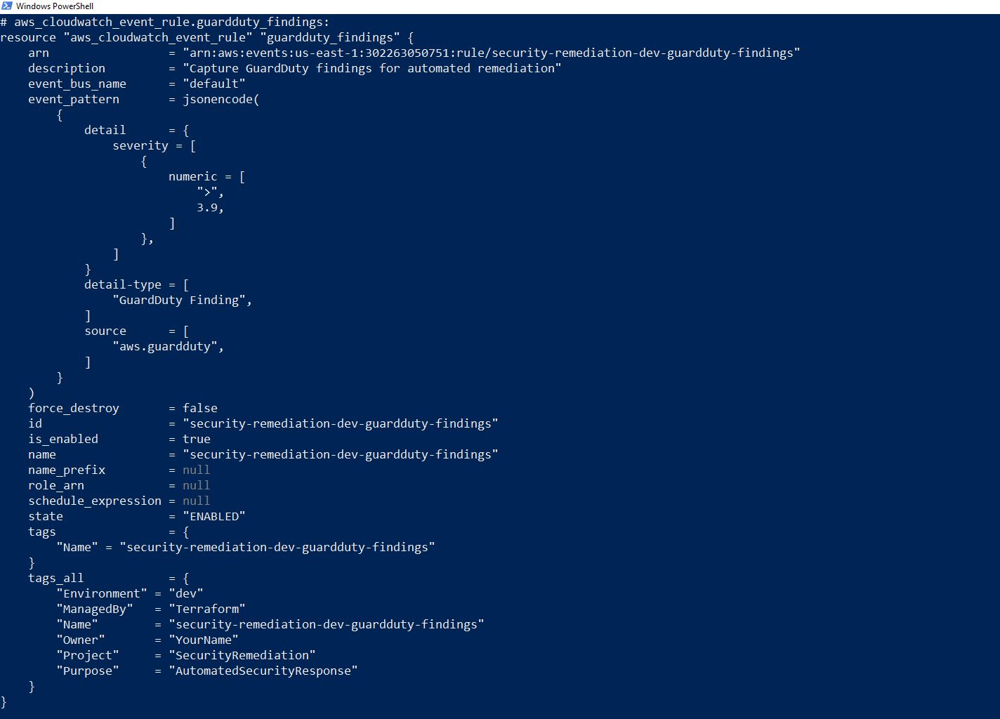
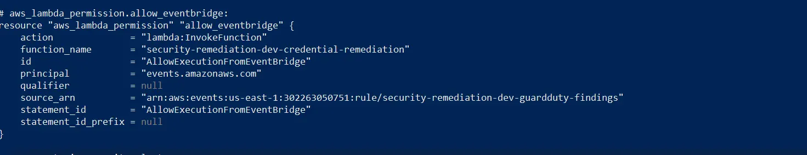
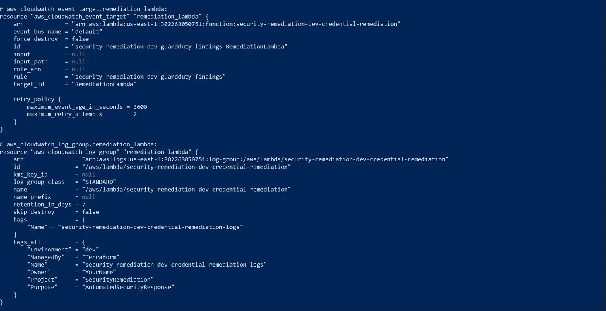

# Infrastructure Overview

## Deployed Resources

This project deploys 12 AWS resources using Terraform to create an automated security remediation pipeline.

**Total Monthly Cost**: ~$6/month (dev environment)

---

## Architecture Flow

```
GuardDuty Detector
    ↓ (Detects credential compromise)
EventBridge Rule 
    ↓ (Routes findings with severity ≥ 4.0)
Lambda Function
    ↓ (Deactivates credentials + quarantines user)
SNS Topic
    ↓ (Sends email notification)
CloudWatch + CloudTrail
    (Complete audit trail)
```

---

## EventBridge Rule Configuration



**What it does**: Filters GuardDuty findings and only routes events with severity ≥ 4.0 to Lambda for automatic remediation.

**Event Pattern**:
- Source: `aws.guardduty`
- Severity: `>= 3.9` (effectively ≥ 4.0 when rounded)
- Enabled: Yes

---

## EventBridge Target & Retry Policy



**Configuration**:
- Target: Lambda function for credential remediation
- Retry attempts: 2
- Maximum event age: 3600 seconds (1 hour)

**Why this matters**: If Lambda fails temporarily (e.g., throttling), EventBridge automatically retries before giving up.

---

## Lambda Invocation Permission



**Security**: This IAM permission allows EventBridge (`events.amazonaws.com`) to invoke the Lambda function.

**Principle of least privilege**: Only EventBridge can trigger this function - it can't be invoked publicly.

---

## Resource List

```bash
$ terraform state list

aws_guardduty_detector.main[0]
aws_cloudwatch_event_rule.guardduty_findings
aws_cloudwatch_event_target.lambda
aws_lambda_function.remediation
aws_lambda_permission.allow_eventbridge
aws_iam_role.remediation_lambda
aws_iam_role_policy.remediation_permissions
aws_iam_role_policy_attachment.lambda_basic
aws_sns_topic.security_alerts
aws_sns_topic_policy.security_alerts
aws_sns_topic_subscription.email
aws_cloudwatch_log_group.remediation_lambda
```

**12 resources total**

---

## Lambda Function Details

- **Runtime**: Python 3.11
- **Memory**: 256 MB
- **Timeout**: 60 seconds
- **Handler**: `main.lambda_handler`

**What it does**:
1. Extracts compromised username from GuardDuty finding
2. Lists all access keys for that user
3. Deactivates all access keys (`iam:UpdateAccessKey`)
4. Attaches explicit deny-all policy (`iam:PutUserPolicy`)
5. Deletes console login profile (`iam:DeleteLoginProfile`)
6. Logs incident to Secrets Manager
7. Publishes SNS notification

**Execution time**: 2-4 seconds end-to-end

---

## Cost Breakdown (Dev Environment)

| Service | Monthly Cost |
|---------|-------------|
| GuardDuty | $4.66 |
| Lambda | $0.20 |
| EventBridge | $0.10 |
| SNS | $0.05 |
| CloudWatch Logs | $0.50 |
| Secrets Manager | $0.40 |
| **Total** | **~$6/month** |

---

## Deployment

```bash
# Clone repo
git clone https://github.com/JhamelT/security-remediation-platform.git
cd security-remediation-platform

# Configure variables
cp terraform.tfvars.example terraform.tfvars
# Edit terraform.tfvars with your email

# Deploy
terraform init
terraform plan
terraform apply

# Confirm SNS email subscription
```

**Deployment time**: ~3 minutes

---

## Why I Built This

At my current role, I automated reporting workflows that saved 60+ hours monthly. I wanted to apply that same automation mindset to a new domain - cloud security - to demonstrate I can design production-grade solutions beyond just following tutorials.

The measurable impact:
- **MTTR improvement**: 2-4 hours (manual) → <60 seconds (automated) = 99% faster
- **Cost**: $6/month vs. $100K+/year for commercial SOAR platforms
- **Scale**: Designed to handle 100K+ events/second using serverless architecture

This project shows I understand event-driven architectures, Infrastructure as Code, and how to solve real business problems with cloud automation.
